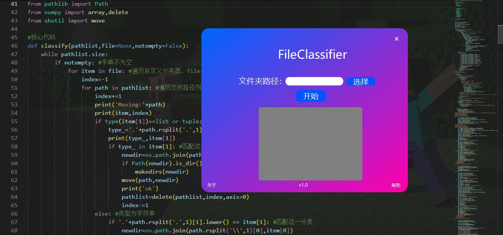

# 👀关于本作品

## 👏作者
- B站：Eric学编程

## ✍描述
本作品由`Python`语言完成，可以用来**整理乱作一团的文件**，更多帮助请见`README.md`或`help.html`，也可以看`GitHub`开源仓库呈现的`markdown`文档。

## 📖参考材料
- 《PyQt5从入门到实践》
- 《零基础Python从入门到精通》
- CSDN的博客
- 知乎的文章
